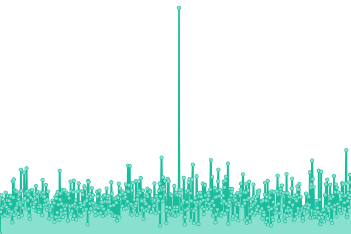
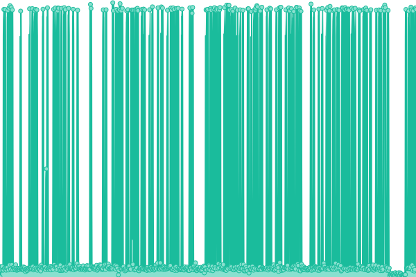
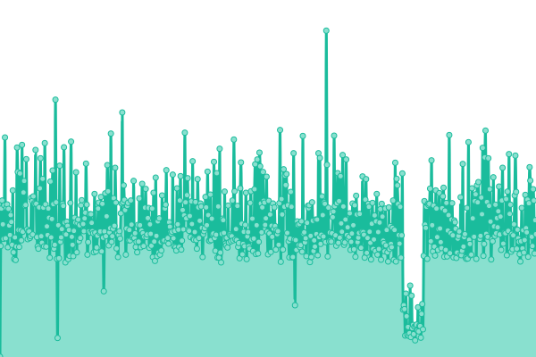

# [📈 Live Status](https://ru4en.github.io/upptime-public): <!--live status--> **🟧 Partial outage**

This repository contains the open-source uptime monitor and status page for [Ruben Lopes](https://rubenlopes.uk), powered by [Upptime](https://github.com/upptime/upptime).

With [Upptime](https://upptime.js.org), you can get your own unlimited and free uptime monitor and status page, powered entirely by a GitHub repository. We use [Issues](https://github.com/ru4en/upptime-public/issues) as incident reports, [Actions](https://github.com/ru4en/upptime-public/actions) as uptime monitors, and [Pages](https://ru4en.github.io/upptime-public) for the status page.

<!--start: status pages-->
<!-- This summary is generated by Upptime (https://github.com/upptime/upptime) -->
<!-- Do not edit this manually, your changes will be overwritten -->
<!-- prettier-ignore -->
| URL | Status | History | Response Time | Uptime |
| --- | ------ | ------- | ------------- | ------ |
|  [rubenlopes.uk](https://www.rubenlopes.uk) | 🟩 Up | [rubenlopes-uk.yml](https://github.com/ru4en/upptime-public/commits/HEAD/history/rubenlopes-uk.yml) | 

 355ms
     
 | 

<a href="https://pub-up.rlab.uk/history/rubenlopes-uk">100.00%</a>
    

|  [UptimeKuma](https://up.rlab.uk/status/public-homelab) | 🟥 Down | [uptime-kuma.yml](https://github.com/ru4en/upptime-public/commits/HEAD/history/uptime-kuma.yml) | 

 158ms
     
 | 

<a href="https://pub-up.rlab.uk/history/uptime-kuma">0.00%</a>
    

|  [InviteTracker](https://invite-tracker.rlab.uk/) | 🟥 Down | [invite-tracker.yml](https://github.com/ru4en/upptime-public/commits/HEAD/history/invite-tracker.yml) | 

 147ms
     
 | 

<a href="https://pub-up.rlab.uk/history/invite-tracker">0.00%</a>
    

<!--end: status pages-->

[**Visit our status website →**](https://ru4en.github.io/upptime-public)

## 📄 License

- Powered by: [Upptime](https://github.com/upptime/upptime)
- Code: [MIT](./LICENSE) © [Anand Chowdhary](https://anandchowdhary.com), supported by [Pabio](https://pabio.com)
- Data in the `./history` directory: [Open Database License](https://opendatacommons.org/licenses/odbl/1-0/)
